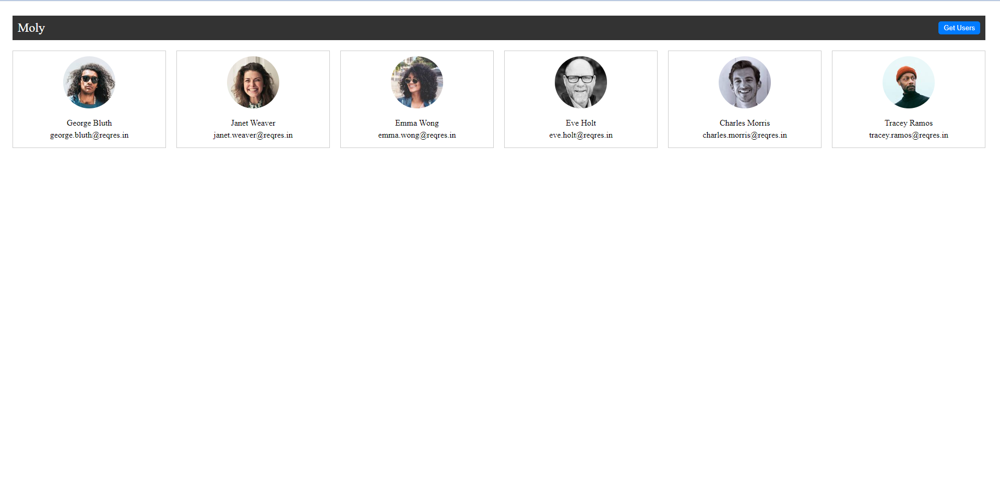

# User Card Grid with API Fetch

A simple React application that displays user data in a grid of user cards. The user data is fetched from the ReqRes.in API when the "Get Users" button is clicked.



demo[LINK](https://spiffy-otter-fba2f9.netlify.app/)

## Features

- Fetches user data from an external API.
- Displays user information in a responsive grid layout.
- Includes a loading state to provide user feedback during data fetching.

## Installation

1. Clone the repository:

   ```bash
   git clone https://github.com/samueltezera28/LGMVIP-Web-02.git
   ```

2. Navigate to the project directory:

   ```bash
   cd user-card-grid
   ```

3. Install the dependencies:

   ```bash
   npm install
   ```

## Usage

1. Start the development server:

   ```bash
   npm start
   ```

2. Open your browser and navigate to [http://localhost:3000](http://localhost:3000) to view the app.

3. Click the "Get Users" button to fetch and display user data.

## Technologies Used

- React
- Axios (for making API requests)
- HTML
- CSS (styling)

## Credits

- User data fetched from [ReqRes.in API](https://reqres.in/api/users)

## License

This project is licensed under the [MIT License](LICENSE).

```